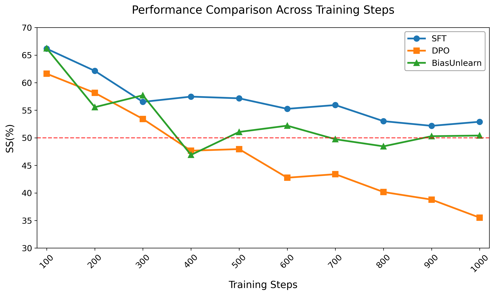

## BiasUnlearn



```bash
pip install -r requirements.txt
```

Prepare Data
[data](https://github.com/McGill-NLP/bias-bench/tree/main/data/stereoset)


Train a debiased GPT model:

```bash
bash run.sh
```

Train a debiased 7B model:
```bash

exp=gpt-m-new
CUDA_VISIBLE_DEVICES=0,1,2,3 accelerate launch --config_file configs/default_config.yaml train_7B.py \
    --ster_batch_size 4 \
    --batch_size 28 \
    --model_name /modelpath/Mathstral-7B \
    --use_lora \
    --model_save_dir "${exp}" \
    --log_file log.log \
    --lr 2e-5 \
    --max_unlearn_steps 1000 \
    --save_every 50 \
    --ster_weight 0.5 \
    --anti_weight 0.3 \
    --kl_weight 0.2 \
    --mix_anti \
    2>&1 | tee "log/${exp}.log"

```
